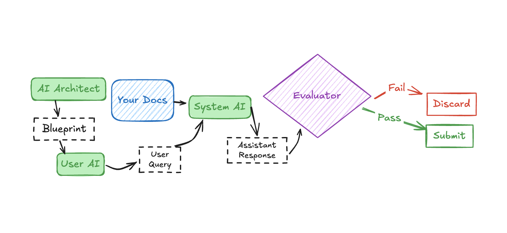
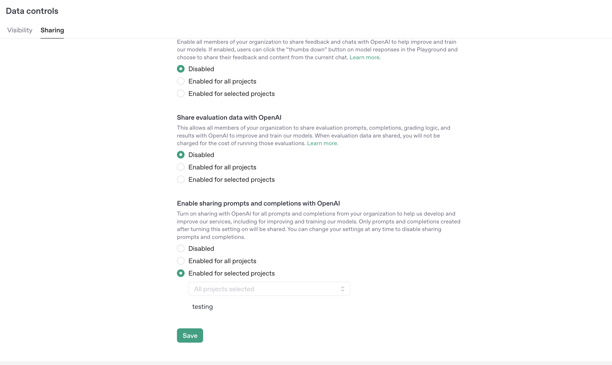
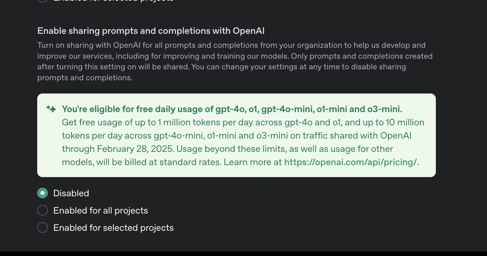
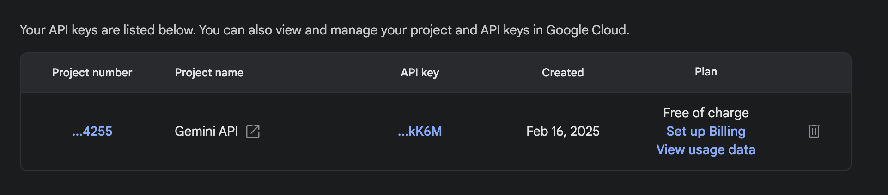

# Infinite AI SEO

> 📰 **[Anetic Daily Intelligence](https://anetic.co)** - Get AI news personalized to your interests, delivered daily.


Frontier model providers want your data to train their models on. Let's give them the data that **you** want them to have. The idea behind Infinite AI SEO is to continuously generate high-quality conversations about your product or service grounded in your data, that can be used to train the next generation of LLMs. Google provides daily free tokens in exchange for your data, and for OpenAI, it's incredibly cheap with GPT-4o-mini. Why not manufacture millions of tokens worth of simulated conversations of 'users' raving about your product every single day?

Provide your documentation or other content to the /context folder, specify what your product/service is about in the config.yaml file, and run the pipeline, to generate hundreds of high quality conversations about your product every single day.

## Will this actually work?

Maybe, I can't guarantee it, I'm sure these companies have data pipelines to clean the data, but from early testing, it seems to work. I've poured over 100 million tokens through this pipeline, and with the latest improvements to GPT-4o, it now knows about our podcast. Coincidence? I think not.

## How does it work?



1. 🤖 An AI architect designs a conversation blueprint, carefully crafting user personas and scenarios.
2. 🗣️ The system generates natural user queries based on this blueprint
3. 📚 Relevant context is pulled from your documentation to inform responses
4. 💬 The system AI crafts the most important message, the response to the user query, using the context to provide accurate answers
5. ✨ Each conversation is evaluated by an LLM judge for quality and authenticity. Only conversations that score above 70 are submitted.
6. 🔄 High-quality conversations continue with natural follow-up questions
7. ⚡ The system automatically manages token limits and switches between different AI models as needed
8. ⌛️ If all limits are hit, the pipeline will just wait 24 hours before it starts again, indefinitely if you don't stop it.

## Quick Start

### 1. Install dependencies:

```bash
pip install -r requirements.txt
```

### 2. Set up environment variables:

```bash
cp .env.template .env
# Edit .env with your API keys
# IMPORTANT: Make sure you use 'free' API keys that are set up to share the data. More on this below.
```

### 3. Add your documentation/content:

- If you have context files that you want the pipeline to use to provide grounded answers, place these markdown files in the `context/` folder. Currently only markdown files are supported, feel free to make a PR to add other file types.
- Supports nested directories (e.g., `context/docs/api.md`, `context/guides/setup.md`)
- Admittedly, this is a very simple RAG implementation, feel free to modify the `src/context_manager.py` file to optimize it for your needs.

### 4. Modify the config.yaml file to add your product/service information and settings:

**Essential Settings to modify!!!**

- `global.topic`: A short description of your product/service (used in prompts)
- `global.overview`: Detailed description of your product/service and goals
- `global.continue_conversation_for_n_messages`: Number of follow-up messages to generate in each conversation. 1 is the default.
- `global.enable_infinite_mode`: Whether or not to run the pipeline indefinitely, meaning it reruns every 24 hours. Defaults to true!!
- `model_tiers.[model_tier_name].daily_token_limit`: Set the daily token limit for the model tier. Defaults to 1,000,000 tokens a day for small models, which is around 0.38 cents a day with gpt-4o-mini. And 100,000 tokens a day for large models, which is around 0.63 cents a day with gpt-4o.
- `model_tiers.[model_tier_name].enabled`: All enabled by default, you can disable any tier you'd like, if you want it to be fully free, disable the OpenAI tiers and just use Gemini.

**Other optional settings:**

**Model Configuration**

- `model_tiers`: Configure different tiers of models with their own limits
  - `tier_order`: List of providers to use and the order they run in. Currently only `openai` and `gemini` are supported. 'large models' and 'mini models' are for openAI. Remove a provider if you don't want it to be used.
  - `enabled`: Toggle specific tiers on/off
  - `daily_token_limit`: Daily token limit for OpenAI models
  - `daily_request_limit`: Daily request limit for Gemini models
  - `env_key`: Environment variable name for the API key

**Token Tracking**

- `token_tracking.auto_switch`: Enable automatic switching between model tiers
- `token_tracking.min_tokens_percent`: Stop when this percentage of daily tokens remains

**Evaluation**

- `evaluation.enabled`: Toggle conversation quality checks
- `evaluation.cutoff_score`: Minimum score (0-100) for a conversation to pass

**Vector DB (for context/docs)**

- `vector_db.enabled`: Toggle context-aware responses
- `vector_db.similarity_threshold`: Minimum similarity score (0-1) for context matches
- `vector_db.chunk_size`: Number of tokens per chunk for context
- `vector_db.chunk_overlap`: Number of tokens to overlap between chunks

## 5. Run the pipeline:

```bash
python main.py index  # Index the context files if you have them
python main.py run  # Generate conversations
python main.py reindex  # Reindex the context files if you add more or update them
```

## Setting up API keys

For OpenAI:

- Create an account on [platform.openai.com](https://platform.openai.com), if you don't already have one
- Create a NEW project
- Go to Settings -> Data Controls -> Sharing
  

- Under 'Enable sharing prompts and completions with OpenAI', select 'Enabled for selected projects', then select your project and click 'Save'

- You _may_ see a message in here that says "You're eligible for free daily usage of gpt-4o, 01, gpt-4o-mini, o1-mini and o3-mini" If you do, yay! You get free tokens every day. I'm not sure who is eligible and who isn't, but if you see that then you get 10m tokens every day for gpt-4o-mini. Use these.
  

- Go to Settings -> API keys, and create a new key for the project you created
- Copy the key and paste it into the .env file as the value for OPENAI_API_KEY
- Some may not get the free daily tokens, and if so, I urge you to modify the config.yaml file to modify the number of tokens you want to use per day.

For Google:

- As per their [pricing](https://ai.google.dev/pricing#2_0flash) page, you can see that Google provides free tokens every day if they can use them to train their models.
- Log into [Google AI Studio](https://aistudio.google.com/)
- Click 'Get API Key', then create a new key.
- It should say under Plan: 'Free of charge':
  
- Copy the key and paste it into the .env file as the value for GOOGLE_GEMINI_API_KEY

- If you go to 'Create a Prompt', under the model dropdown, it will show you what your daily limit is. In the config.yaml file, it's set up for 1500 requests per day, but you can change that if this number changes. The pipeline will continue to run until it gets an API error saying you've hit your limit.

## Directory Structure

- `context/`: Documentation/content to be indexed
- `conversations/`: Conversations generated by the pipeline
  - `unprocessed/`: User queries awaiting review
  - `curated/`: Approved conversations
  - `processed/`: Submitted conversations
- `logs/`: Logs from all runs

## Tips

- Modify the prompts!!! The default prompts should work pretty well, but if you want to modify them you can in the `src/prompts.py` file. I'd advise you to run the pipeline once, see what kind of conversations it generates, and then modify the prompts to get the best results for your product/service.

- You may want to tweak the `src/context_manager.py` file to optimize it for your needs, it is a very simple RAG implementation, but it works. Chunk size, chunk overlap,

- You could use two different API keys for generating conversations and submitting them. I don't think this matters too much, but if you wanted it to be 'pure', where only the generated conversations are submitted, you could do that.

- If you really wanted to go through tokens, you could probably modify this repo so that it rotates through gemini models after it runs out of requests for one model. I don't have this set up, but it shouldn't be too difficult to add.

- The xAI Grok API has an option for data collection too, and $150 in free credits each month if you opt in. I haven't added it yet, if you feel compelled to add it please make a PR!

## FAQ

- **Is this free to use?**

  If you use only Gemini, it is. OpenAI will cost you unless you are eligible for the free daily tokens.

- **Can I modify the prompts?**

  Yes!! And arguably, you should. You can modify the prompts in the `src/prompts` folder.

- **How do I stop the pipeline?**

  Press `Ctrl+C` in the terminal.

## Contributing

- Contributions are welcome! Please feel free to open an issue or a PR. I made this entire project by vibe coding in an afternoon, so there are probably some bugs and improvements that could be made.
